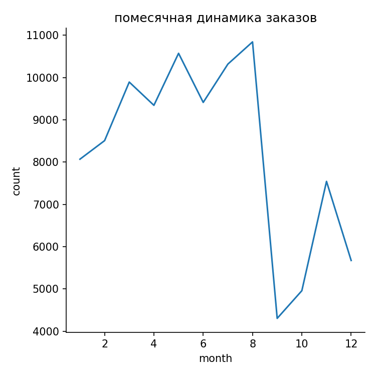
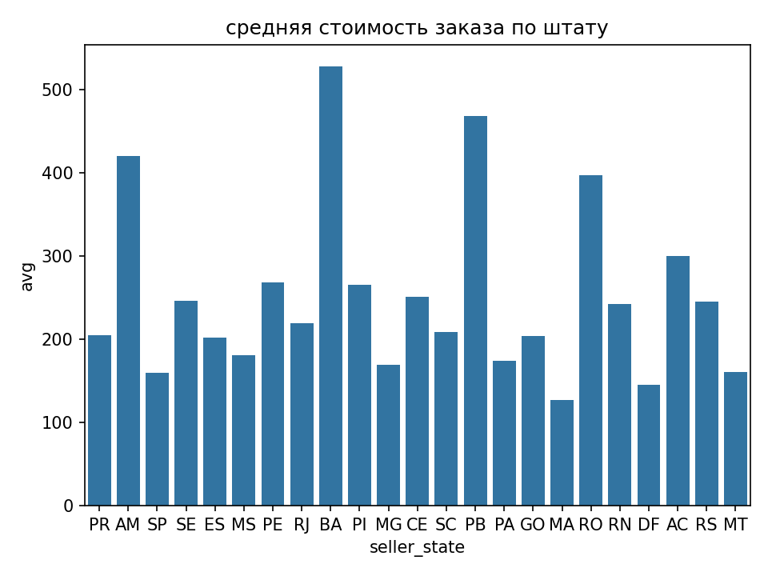
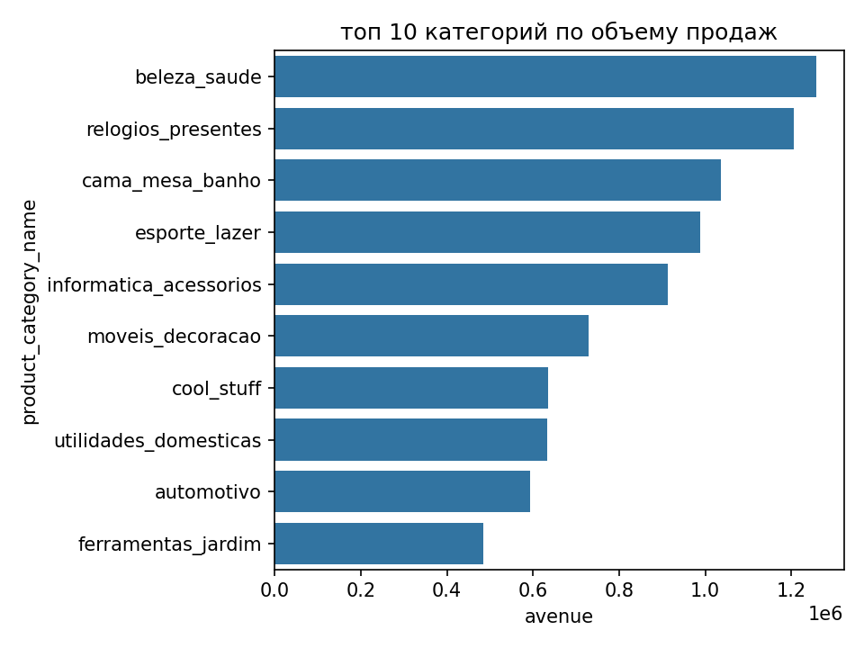
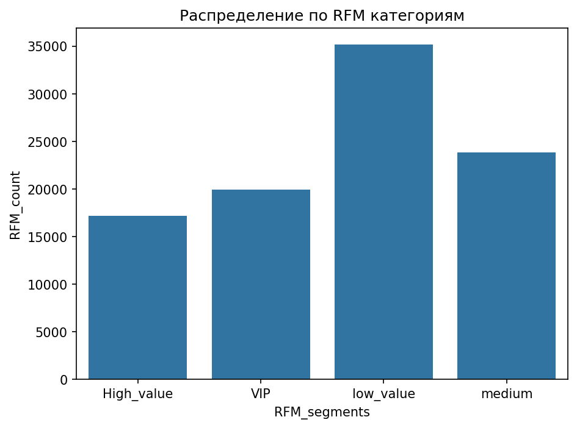

# Olist Brazilian E-Commerce: SQL & Polars Analysis

Аналитический проект на реальном датасете бразильского маркетплейса Olist (100k+ заказов).

## Описание проекта

Проект выполнен в рамках самостоятельного изучения SQL, Polars и визуализации данных. Включает 10 аналитических запросов на SQL (SQLite) и их полный перенос на Python (Polars) с построением графиков.

Датасет: [Brazilian E-Commerce Public Dataset by Olist](https://www.kaggle.com/datasets/olistbr/brazilian-ecommerce)

---

## Решенные аналитические задачи

| № | Задача | SQL | Polars |
|---|--------|-----|--------|
| 1 | Помесячная динамика заказов | ✅ | ✅ |
| 2 | Топ-10 категорий по выручке | ✅ | ✅ |
| 3 | Города с наибольшим числом оценок "5" | ✅ | ✅ |
| 4 | Среднее время доставки по штатам | ✅ | ✅ |
| 5 | Клиенты без повторных покупок | ✅ | ✅ |
| 6 | Самые быстрые доставки | ✅ | ✅ |
| 7 | Товары, которые никогда не оплачивали картой | ✅ | ✅ |
| 8 | Средняя стоимость заказа по штатам продавцов | ✅ (оконная) | ✅ |
| 9 | Рейтинг продавцов по выручке внутри штата | ✅ (ROW_NUMBER) | ⏳ |
| 10 | Скользящее среднее выручки (3 месяца) | ✅ (ROWS BETWEEN) | ⏳ |
| 11 | RFM сегментация клиентов |✅| |✅|
---

## Используемые технологии

### SQL (SQLite)
- `JOIN`, `GROUP BY`, `HAVING`, `ORDER BY`, `LIMIT`
- Подзапросы: скалярные, табличные, коррелированные, `NOT IN`
- Оконные функции: `ROW_NUMBER`, `AVG` с `PARTITION BY`, рамки окна (`ROWS BETWEEN`)
- Работа с датами: `JULIANDAY`, `STRFTIME`
- `CASE`, `UNION`, `INSERT/UPDATE/DELETE`

### Python (Polars)
- Чтение CSV, `try_parse_dates`
- `join`, `filter`, `group_by`, `agg`, `sort`, `limit`
- Работа с датами: `.dt.month()`, разница дат через `-`
- Оконные функции: `.mean().over()`, `.unique()`
- Агрегация с условием: `(pl.col("col") == value).sum()`

### Визуализация
- **Matplotlib**: `plt.subplots()`, `plt.show()`, `plt.savefig()`
- **Seaborn**: `lineplot`, `barplot`, `relplot`
- **NumPy**: `linspace`, векторизация, broadcasting

### Инструменты разработки
- **Git & GitHub**: контроль версий, публичное портфолио
- **DB Browser for SQLite**: работа с локальной БД
- **PyCharm**: среда разработки Python

---

## Визуализации

### Помесячная динамика заказов


### Средняя стоимость заказа по штатам продавцов


### Топ-10 категорий по выручке


### RFM-анализ клиентов


## ML-сервис

Построена модель классификации `review_score` (LogisticRegression).

**Признаки:**
- `price`
- `freight_value`
- `payment_value`

**API:** FastAPI
- `POST /predict` — принимает JSON с признаками, возвращает предсказанную оценку (1-5)

---
```text
olist-sql-analysis/
├── sql/
│   └── projsql.sql               # 10 аналитических SQL-запросов
├── python_polars/
│   └── analysis.py               # Перенос запросов на Polars + визуализация
├── plots/
│   ├── monthly_dynamics_of_orders.png
│   ├── avg_payments_by_state.png
│   └── best_category_in_sell.png
├── README.md
└── .gitignore                    # Исключение .db и .sqbpro
```
---
### RFM-анализ клиентов

Сегментация клиентов по трём метрикам:
- **Recency** — давность последнего заказа
- **Frequency** — количество заказов
- **Monetary** — средний чек

Клиенты разбиты на 4 сегмента: `low_value`, `medium`, `high_value`, `VIP`.

## Автор

**Артеменко Пётр**  
Студент ТюмГУ, направление «Математическое обеспечение и администрирование информационных систем»  
[GitHub](https://github.com/petra882)

---

## Статус проекта

✅ SQL: завершён (10 запросов)  
✅ Polars: 8 запросов перенесено  
✅ Визуализация: 3 графика  
🔜 ML: Scikit-learn пайплайны, первая модель
